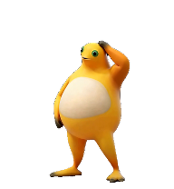

# 奶蛙 Codex Pet · Linux / macOS

奶蛙跟随 Codex 工作状态自动播放。v4.5 在长时间思考时只循环挠头，抬手仅播放一次，思考结束后自然放下；按住拖动则浮起悬停，松手落下。



**[下载 v4.5 Linux 安装包](https://github.com/smap20/codex-pet-naifrog/releases/download/v4.5/naifrog-v4.5-linux.zip)** · [版本与校验文件](https://github.com/smap20/codex-pet-naifrog/releases/tag/v4.5) · [思考动作前后对比](thinking-preview.mp4) · [抠图修复对比](preview.mp4)

macOS 支持已包含在仓库安装器中；克隆仓库后运行 `bash install.sh`。安装器会先校验 App 的版本、完整归档和被修改模块的 SHA-256，不匹配就停止。

| 平台 | 已验证的 App 版本 | 安装方式 |
| --- | --- | --- |
| Linux | `26.903.61454` | 备份后原位更新 `app.asar` |
| macOS Apple Silicon | `26.903.71938`、`26.908.31748` | 创建 `~/Applications/ChatGPT Naifrog.app`，官方 App 不变 |

不同架构、版本或分发渠道即使版本号相同，也必须同时匹配代码指纹。v4.4 Linux 用户可直接升级并保留回退路径。

这是第三方本地扩展，与 OpenAI 没有关联。不同来源的素材保留各自许可状态，见 [SOURCES.md](SOURCES.md)；本仓库没有将全部素材统一声明为 MIT 或公有领域。

## 安装

```bash
bash install.sh check
bash install.sh
```

完成后完全退出 ChatGPT/Codex，再打开安装后的应用，并在宠物列表选择“奶蛙”。只关闭窗口可能仍在使用旧播放器。OpenAI 的[宠物文档](https://learn.chatgpt.com/zh-Hans/docs/pets)说明了桌面宠物选择和刷新方式。

macOS 会生成一个并排安装的 App：

```text
~/Applications/ChatGPT Naifrog.app
```

它沿用官方 App 的标识和数据目录，让登录、设置及 `~/.codex/pets` 继续可用。请不要同时运行官方 App 与奶蛙 App。需要指定源或目标时：

```bash
bash install.sh install --app "/Applications/ChatGPT.app"
bash install.sh install --app "/Applications/ChatGPT.app" \
  --target-app "$HOME/Applications/My Naifrog.app"
```

修改 Electron 资源会使 Apple/OpenAI 的原始开发者签名失效，因此安装器更新 `ElectronAsarIntegrity` 后会对副本做本机 ad-hoc 深度签名，并严格复验。这个副本不再是 OpenAI 签名或公证的原件；介意这一点时不要安装。官方 App 从始至终不会被修改，卸载也只移除安装记录中的副本。App 升级后需等待仓库适配新指纹，再从更新后的官方 App 重新生成副本。

Linux 的系统 App 目录可能需要管理员权限；请以普通用户运行脚本，脚本只在实际写入时调用 `sudo`。macOS 默认写入用户自己的 `~/Applications`，不需要管理员权限。

默认宠物目录是 `${CODEX_HOME:-~/.codex}/pets/naifrog/`。使用其他数据目录时加 `--codex-home /实际数据目录`。

## 卸载与保护

```bash
bash uninstall.sh
```

备份和事务记录保存在 Codex 数据目录的 `naifrog-installer/`。重复安装同一版本不会重做。卸载前会校验 App、Electron 完整性记录、签名和宠物文件；如果它们已被升级或另行修改，操作会停止，避免覆盖新内容。

安装过程使用暂存目录和原子切换。Linux 异常时恢复 `app.asar` 与旧宠物；macOS 异常时移除尚未完成的副本并恢复旧宠物。备份默认保留。

## 1401 帧播放器

完整动画包含挠头、聆听、说话、摸肚子、眩晕、漂浮和捧腹大笑，并修复瞳孔、手掌、手指与脚趾误抠。不能只复制 `pet/` 获得完整动画：标准宠物清单只识别固定图集，本项目还会给经过精确校验的 App 安装动画清单加载器与播放器。

抬手只播放一次，随后只循环原始第 22–49 帧。思考结束后从当前姿势继续到放手，再进入最新任务状态；正常退出最长约 2.4 秒。短任务在抬手途中结束时原路放回，放手途中又开始思考则从当前位置重新接上。拖动和鼠标交互仍优先响应。

## 包内内容

- `pet/`：v4.5 动画清单、1401 帧图集和兼容标准播放器的精灵图。
- `runtime/`、`install.py`：跨构建动画播放器、macOS 完整性/签名处理和事务安装源码。
- `tests/`、`verification/`：控制器、安装器、真实 App 沙盒重建和恢复检查。
- `licenses/`、`source/`、`SOURCES.md`：来源、许可文本、源视频及处理代码记录。
- `SHA256SUMS.json`：包内文件校验表。

包内不包含 Codex 主程序、账号凭据、个人配置或聊天记录。App 补丁只在接收者电脑上生成，并要求生成结果与已验证指纹完全一致。

漂浮落地约第 65–75 帧的脚部灰色块是源视频尘土特效，保留原样。大笑结尾保留源视频剪切与短暂转场；没有用冻结动作、缩减关键帧或 AI 重画替换完整动作。
