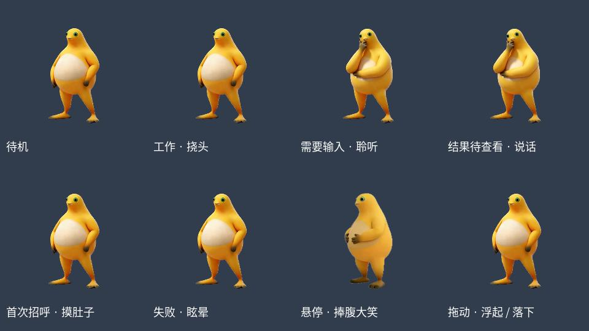

# 奶蛙 Codex Pet · Linux

在 Codex 桌面应用里养一只奶蛙：跟随工作状态自动播放，按住拖动时浮起悬停，松手落下。v4.4 保留完整 1401 帧，并修复眼睛、手掌和脚趾的抠图缺损。



**[下载 Linux 安装包](https://github.com/smap20/codex-pet-naifrog/releases/download/v4.4/naifrog-v4.4-linux.zip)** · [版本与校验文件](https://github.com/smap20/codex-pet-naifrog/releases/tag/v4.4) · [修复前后视频](preview.mp4)

将 ZIP 发给朋友，在他的 Codex 中附上文件并发送：

> 请解压这个奶蛙安装包，阅读 INSTALL_FOR_CODEX.md，检查兼容性并安装。

也可以克隆本仓库，在仓库目录运行 `bash install.sh`。当前适配 **Linux Codex App 26.903.61454，且程序指纹必须匹配**；不是所有同版本发行构建都能直接安装。安装器会先检查，失败时保留现状。

这是第三方本地扩展，与 OpenAI 没有关联。不同来源的素材保留各自许可状态，详见 [SOURCES.md](SOURCES.md)；本仓库没有将全部素材统一声明为 MIT 或公有领域。

---

# 安装与恢复说明

完整的 1401 帧动画，包含挠头、聆听、说话、摸肚子、眩晕、漂浮和捧腹大笑。已经修复瞳孔、手掌、手指与脚趾误抠。动作跟随 Codex 状态自动播放；拖动时按住升起并悬停，松手才落下。

**适用：Linux，Codex App `26.903.61454`，并且程序指纹匹配。** 其他构建会在检查阶段停止，保持原文件。不能只复制 `pet/` 来得到完整动画；本包还会安装相应播放器扩展。

## 最简单：交给你的 Codex

把 ZIP 附到 Codex，发送：

> 请解压这个奶蛙安装包，阅读 INSTALL_FOR_CODEX.md，检查兼容性并安装。安装完成后告诉我如何启用。

## 自己安装

解压 ZIP，在解压后的目录打开终端，运行：

```bash
bash install.sh
```

只需要 Python 3.8+ 标准库，安装无需联网、pip、Node 或图像模型。请以自己的普通用户运行；**不要在整条命令前加 sudo**。写入系统应用目录时，脚本会通过 sudo 请求 Linux 密码。

完成后，**完全退出并重新打开 Codex**，在宠物列表选择“奶蛙”。只关闭窗口可能仍使用旧播放器。脚本不会强行终止当前聊天，也不会更改账号、聊天记录或其他偏好设置。

## 检查、非默认路径和卸载

仅检查，不修改 App 或宠物：

```bash
bash install.sh check
```

如果未自动找到 Codex，可指定实际路径：

```bash
bash install.sh install --app /实际安装目录/resources/app.asar
```

默认安装到 `${CODEX_HOME:-~/.codex}/pets/naifrog/`；如 Codex 使用另一个数据目录，请增加 `--codex-home /实际数据目录`。

恢复安装前的 App 与宠物：

```bash
bash uninstall.sh
```

备份和记录保存在 Codex 数据目录下的 `naifrog-installer/`。重复安装同一版本会直接报告已安装。卸载前会校验当前文件；如果 App 已升级或宠物被另行修改，会停止，避免用旧备份覆盖新内容。备份保留，不自动删除。

## 包里有什么

- `pet/`：当前 v4.4 素材，以及列表读取需要的标准精灵图。
- `runtime/`、`install.py`：完整动画加载器、拖动控制器和安装源码。
- `preview.mp4`：眼睛与手部修复前后对比。
- `verification/`：原动画检查记录及此安装包的独立沙盒验证结果。
- `licenses/`、`source/`、`SOURCES.md`：来源、许可文本、源视频及处理代码记录。
- `SHA256SUMS.json`：包内文件校验表。

包内不包含 Codex 主程序、账号凭据、个人配置或聊天记录。App 补丁只在接收者电脑上生成，并要求生成结果与已经验证的播放器指纹完全一致。

安装包已用真实原版 App 的临时副本验证：首次安装、重复安装、既有播放器、无旧宠物、卸载恢复、后续修改保护、损坏包拒绝，以及 App 已替换后模拟失败的双向回滚均通过。测试未改动制作方正在运行的 App 与宠物；接收者重启后的桌面显示需在安装后查看。

这是当前 Linux 构建的本地扩展包，非官方安装器。Codex 更新可能覆盖扩展；遇到不支持的版本，请保留检查输出用于适配，不要跳过校验。

## 已知画面边界

漂浮落地约第 65–75 帧的脚部灰色块是源视频的尘土特效，保留原样。大笑结尾保留源视频的剪切与短暂转场。没有用冻结动作、缩减关键帧或 AI 重画替换完整动作。
