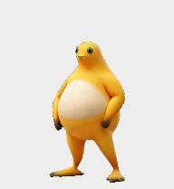
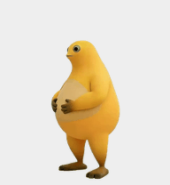
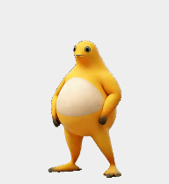
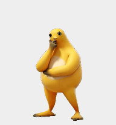

# 奶蛙 Codex Pet · v4.6.1

把奶蛙作为 Codex 桌面宠物：工作时持续挠头，有问题待回答时侧眼等待，首次编辑答案时大笑，鼠标悬停时摸肚子，按住拖动时浮起、松手后落下。

本版包含启动打包修复、缺失图集修复、悬停入口修复、独立提问等待状态，以及历史问题导致侧眼常驻的清理修复。动画素材保留统一大小和位置。

## 支持范围

| 平台 | 最新版状态 |
| --- | --- |
| Linux | 支持经过指纹校验的 Codex / ChatGPT 桌面构建 `26.903.61454` |
| macOS | 最新问题事件逻辑尚未适配；本版安装器拒绝安装。仓库保留 macOS 副本安装、完整性更新和签名实现，供后续迁移 |
| 其他版本、架构或分发渠道 | 未验证；版本号相同也必须匹配完整 App 和各模块的 SHA-256 |

**不能把 Linux 的 `app.asar` 复制到 Mac。** 本仓库不提供修改后的完整 App；安装器从本机已验证的原始 App 构建补丁。

## 安装

需要 Python 3.8+、Git，以及受支持的原始 Linux App。安装器使用 Python 标准库。

```bash
git clone https://github.com/smap20/codex-pet-naifrog.git
cd codex-pet-naifrog
python3 install.py check
bash install.sh
```

检查不会修改 App。安装前请保存工作并完全退出 Codex；安装后重新打开，在宠物选择中选择「奶蛙」。只关闭窗口可能仍有后台进程，无法加载新播放器。

不要对整个脚本使用 `sudo`。写入系统 App 目录时，安装器才会请求管理员权限。自定义路径可通过 `python3 install.py --help` 查看。

### 已安装旧补丁时

本版支持原始受验证构建的安装，以及同版重复安装检查。**不支持任意旧补丁覆盖升级。** 如果检查失败，不要跳过 SHA 校验：先用原安装器及其备份恢复原版，再安装本版。由开发脚本修改过的本机安装也不等同于本安装器管理的安装。

```bash
bash uninstall.sh
```

卸载按本安装器记录恢复 App 与原宠物目录；备份保留。旧安装应使用其对应安装器卸载。

## 动画与触发逻辑

### 自动任务状态

| 触发条件 | 动画 | 结束方式 |
| --- | --- | --- |
| 空闲 `idle` | 待机动作 | 循环，直到状态变化 |
| 工作 `running` | 抬手一次，然后只循环挠头中段（第 22–49 帧，零起始编号） | 工作结束后从当前姿势接到放手；很早结束时原路放回 |
| 普通等待 `waiting` | 原聆听／托下巴动画，46 帧 | 跟随 App 状态；不使用侧眼帧 |
| 结果待查看 `review` | 当前结果查看动作 | 跟随 App 状态 |
| 失败 `failed` | 眩晕动作 | 按动画清单播放 |

任务状态由 Codex App 决定，并不等同于模型每一段文字或每次工具调用。多个任务并行时，App 的状态选择也可能影响宠物。

### 提问与输入：独立于普通等待

1. 当前仍在进行的回合收到异步问题，且问题未回答、未跳过：进入独立的 `$question` 状态。双手放在肚子上侧眼看，取自大笑素材第 30 帧。
2. 第一次修改该问题的答案草稿：播放一次完整大笑。之后连续输入不重复启动；选择答案是否触发取决于该操作是否修改答案草稿。
3. 若笑完仍有问题待回答：返回侧眼等待。
4. 提交或跳过：移除对应问题；回合结束、问题移除或历史记录刷新时同步清理。没有剩余待回答问题时恢复 App 当前状态；已开始的大笑会先播放完。

**这里的输入是异步提问框内的答案编辑，不是任意聊天输入框的所有打字。** 不是从 `waiting` 切到 `running` 就自动大笑。

问题事件在主窗口和宠物窗口间同步，仅发送问题标识及交互计数，不发送答案文本。当前等待队列不是按宠物所属任务单独隔离：其他进行中回合的待回答问题也可能使宠物侧眼。

### 鼠标操作

| 操作 | 行为 |
| --- | --- |
| 悬停奶蛙 | 摸肚子；桌面按钮与宠物预览入口均适配 |
| 按住并拖动 | 按原动画上升，到最高处保持；不松手就不下降 |
| 松手 | 从当前位置接到下降，落地后恢复最新状态 |
| 上升途中松手 | 从当前高度折返，不瞬移到最高处 |
| 下降途中重新抓住 | 从当前姿势重新上升 |

### 同时触发时的优先级

画面优先播放拖动，其次是已启动的大笑，再是持续思考动作的自然收尾，最后是当前请求状态。请求状态优先处理拖动和悬停，然后是待回答问题，最后是普通 App 状态。因此提问刚出现时，可能先看到挠头自然放手；提交后也不会硬切断正在播放的大笑。

开启系统减少动态效果后，部分播放与过渡会简化。宠物没有手动动作点播菜单。

## 动画预览

下列 GIF 从最新版图集中抽样导出，用于辨认动作；为减小文件体积降低了帧率。实际 App 保留原图集帧和时长，思考、拖动及提问时序由上面的状态逻辑控制。

| 动作 | 预览 |
| --- | --- |
| 待机 |  |
| 普通等待：聆听／托下巴 |  |
| 提问待回答：侧眼定格 |  |
| 首次编辑答案：大笑 |  |
| 悬停：摸肚子 |  |
| 思考：原始完整动作 |  |
| 拖动：原始升降动作 |  |
| 失败：眩晕 |  |
| 结果待查看 |  |

[持续挠头时序对比视频](thinking-preview.mp4) · [完整动作候选视频](hover/hover-options.mp4)

## 验证与已知边界

- 安装器验证包内文件、原始 App 和修改模块的 SHA-256；构建结果必须与预期哈希完全一致。
- 最新公开安装器从原始 App 重建的结果，与本机最新版补丁逐字节一致。
- 输入桥测试覆盖跨窗口同步、首次输入去重、提交／跳过、已结束回合和历史问题清理。
- 等待拆分测试覆盖独立侧眼定格与普通 46 帧等待动画。
- 本机交互测试已观察到提问保持显示、输入触发大笑；最近一次提交后的状态恢复仍需持续观察。macOS 最新逻辑未实测。
- 异步提问框受 App 回合生命周期控制。测试时助手需保持回合运行并等待用户回答；助手立即结束回合会使提问框收起。这不等于动画失效。
- App 更新可能使补丁失效。校验不匹配时停止，等待对应版本适配，不强制覆盖。

## 项目结构

- `pet/`：最新版清单、透明图集及标准宠物兼容资源。
- `runtime/`：播放器、问题事件桥和构建相关补丁锚点。
- `install.py`：校验、构建、备份、安装与恢复。
- `tests/`：验证脚本；`docs/previews/`：本版动作预览。
- `SOURCES.md`、`licenses/`：素材来源与许可。

## 素材与许可

代码与动画素材的许可必须分别看待。请阅读 [SOURCES.md](SOURCES.md) 和 [licenses](licenses)，保留原作者署名与来源说明。本项目不将全部素材统一声明为 MIT 或公有领域；公开仓库或个人使用不代表获得了额外素材授权。
